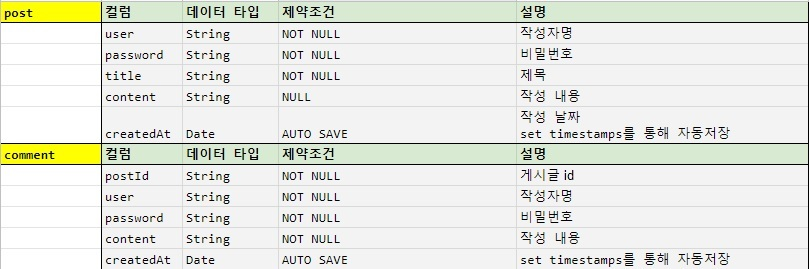
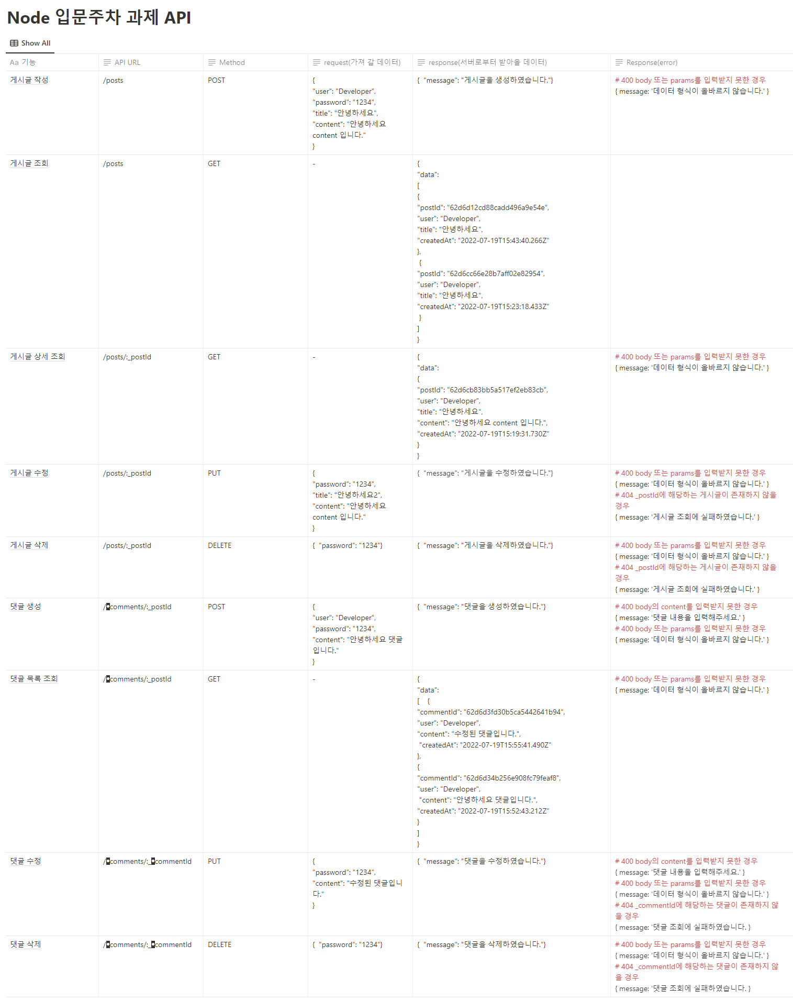

게시판, 댓글 API 서버
=====
> Node.js 입문 주차 과제 - 나만의 블로그 백엔드 서버

# 요구조건
1. 전체 게시글 목록 조회 API
    - 제목, 작성자명, 작성 날짜를 조회하기
    - 작성 날짜 기준으로 내림차순 정렬하기
2. 게시글 작성 API
    - 제목, 작성자명, 비밀번호, 작성 내용을 입력하기
3. 게시글 조회 API
    - 제목, 작성자명, 작성 날짜, 작성 내용을 조회하기 
    (검색 기능이 아닙니다. 간단한 게시글 조회만 구현해주세요.)
4. 게시글 수정 API
    - API를 호출할 때 입력된 비밀번호를 비교하여 동일할 때만 글이 수정되게 하기
5. 게시글 삭제 API
    - API를 호출할 때 입력된 비밀번호를 비교하여 동일할 때만 글이 삭제되게 하기
6. 댓글 목록 조회
    - 조회하는 게시글에 작성된 모든 댓글을 목록 형식으로 볼 수 있도록 하기
    - 작성 날짜 기준으로 내림차순 정렬하기
7. 댓글 작성
    - 댓글 내용을 비워둔 채 댓글 작성 API를 호출하면 "댓글 내용을 입력해주세요" 라는 메세지를 return하기
    - 댓글 내용을 입력하고 댓글 작성 API를 호출한 경우 작성한 댓글을 추가하기
8. 댓글 수정
    - 댓글 내용을 비워둔 채 댓글 수정 API를 호출하면 "댓글 내용을 입력해주세요" 라는 메세지를 return하기
    - 댓글 내용을 입력하고 댓글 수정 API를 호출한 경우 작성한 댓글을 수정하기
9. 댓글 삭제
    - 원하는 댓글을 삭제하기   

## Directory Structure
```
.
├── app.js
├── routes
│   ├── index.js
│   ├── comments.js
│   └── posts.js
└── schemas
    ├── index.js
    ├── comment.js
    └── post.js
```

# DB Schema
</img>

# API 명세서
</img>

# 구현 중 겪은 어려운 부분
#### * Schema 세팅에서 작성시간 자동 저장되게 하는 법
> set timestamps 옵션을 주어 createdAt field를 자동 생성되게 함. [링크][def]
#### * EC2 서버 재가동 후 MongoDB 실행 안되는 문제
> 권한 문제로 파악되어 문제가 되는 파일 삭제 후 재실행 함으로 해결. [링크][def2]

[def]: https://4sii.tistory.com/195
[def2]: https://4sii.tistory.com/203